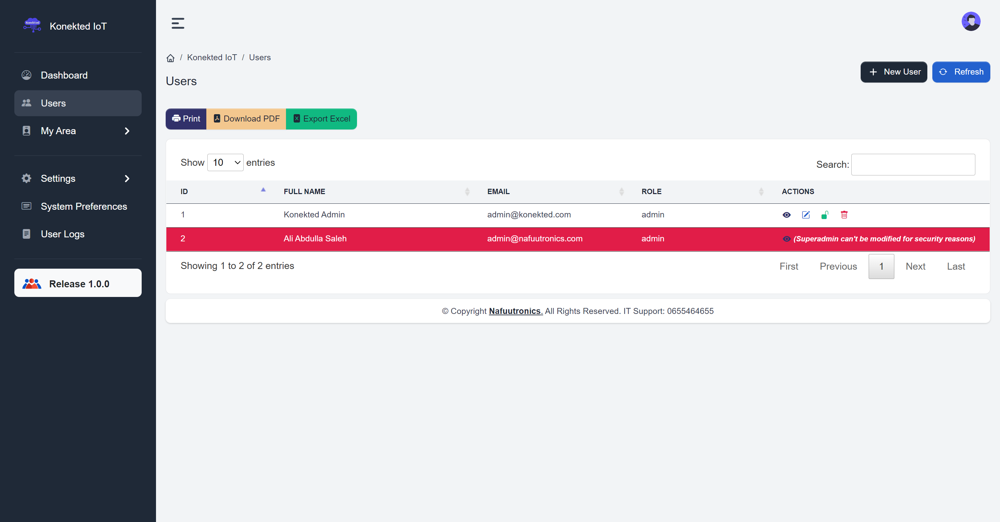

## About Angular Starter Template

Angular starter template was configured to speed up initial project setups and confifurations, it comes will all necessary pages for full-stack application, it uses [laravel 8 backend](https://github.com/eltiwany/laravel-api-wrapper) with [pre-configured JWT authentication by Tymon](https://jwt-auth.readthedocs.io/en/develop/laravel-installation/).

- Home page
- Login and activation pages
- Dashboard
- Users page (support full CRUD functionalities)
- Roles and permissions pages (support full CRUD functionalities) - also preconfigured route guards and action buttons
- Preferences to store key-value pairs on server
- Users logs

#

## About Angular

This project was generated with [Angular CLI](https://github.com/angular/angular-cli) version 12.2.1.

## Development server

Run `ng serve` for a dev server. Navigate to `http://localhost:4200/`. The app will automatically reload if you change any of the source files.

## Code scaffolding

Run `ng generate component component-name` to generate a new component. You can also use `ng generate directive|pipe|service|class|guard|interface|enum|module`.

## Build

Run `ng build` to build the project. The build artifacts will be stored in the `dist/` directory.

## Running unit tests

Run `ng test` to execute the unit tests via [Karma](https://karma-runner.github.io).

## Running end-to-end tests

Run `ng e2e` to execute the end-to-end tests via a platform of your choice. To use this command, you need to first add a package that implements end-to-end testing capabilities.

